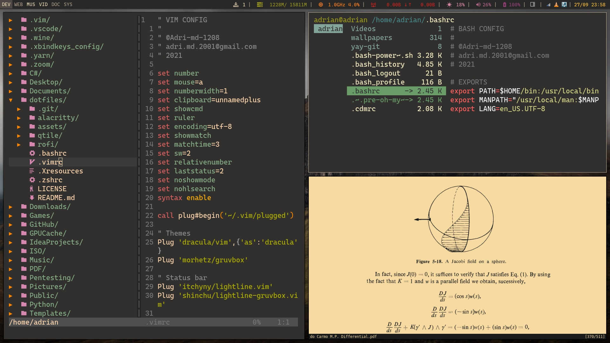

# Adri-md-1208's Dotfiles

## Description
#### What is a dotfile? 
A dotfile is a configuration file for a program that allow customizate it. For example, some terminal emulators have ugly default colors, but you can just redefine some values in his dotfiles and bring it your own style.

#### Why a dotfiles repo?
Is the best way to storage your dotfiles (they are in the cloud!) and share your rices with other users. 

#### Can I use this dotfiles?
Sure!, they are distributed under GPLv3 license. Be free to modify it and share your changes with the community.

## Table of Contents
-    [Window Manager configs](#wmconfigs)
-    [Terminal configs](#termconfigs)
-    [Other configs](#otherconfigs)
-    [Usage](#usage)
-    [License](#license)

### Window Mananger configs
- [qtile](https://github.com/Adri-md-1208/dotfiles/tree/main/qtile/.config/qtile)

### Terminal configs
- [alacritty](https://github.com/Adri-md-1208/dotfiles/tree/main/alacritty/.config/alacritty)
- [xterm](https://github.com/Adri-md-1208/dotfiles/blob/main/.Xresources)
- [bash](https://github.com/Adri-md-1208/dotfiles/blob/main/.bashrc)
- [zsh](https://github.com/Adri-md-1208/dotfiles/blob/main/.zshrc)

### Other configs
- [rofi](https://github.com/Adri-md-1208/dotfiles/tree/main/rofi/.config/rofi)

## Usage
Clone the repo locally and move the files to your $HOME/.config directory.

    git clone https://github.com/Adri-md-1208/dotfiles

## License
Published under GNU GPLv3 license. See [LICENSE](https://github.com/Adri-md-1208/dotfiles/blob/main/LICENSE) for details
