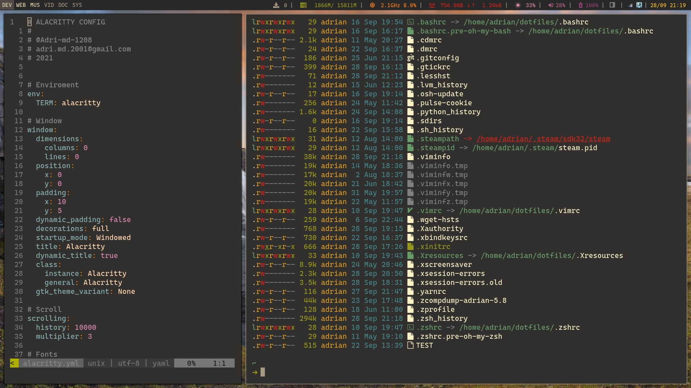
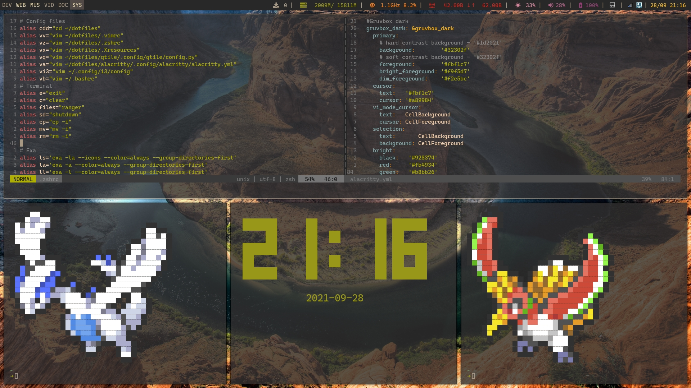

#Alacritty dotfiles

## Description
### What is Alacritty?
Alacritty is a fast, cross-platform, OpenGL terminal emulator, as described in his [repo](https://github.com/alacritty/alacritty)

### Why Alacritty?
Its easy to configure via a xml-like dotfile. I customize it to have minimal apparence combined with my system colorscheme (gruvbox).

### Screenshots

