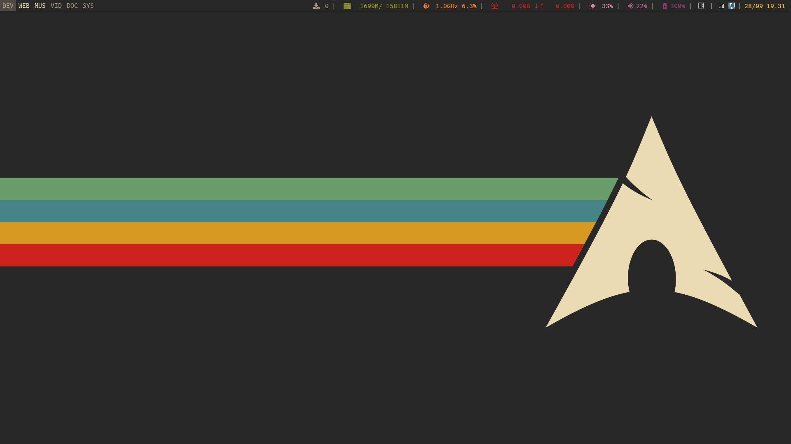
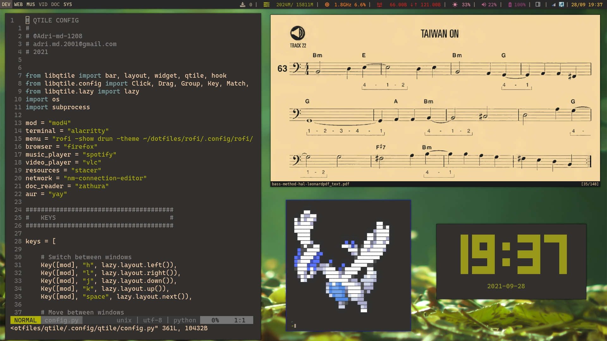
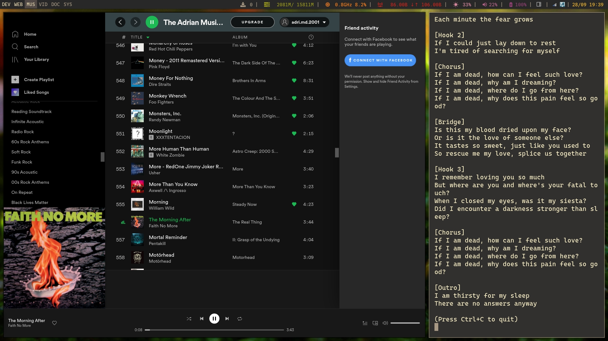
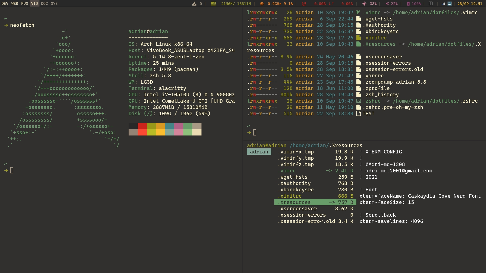

# Qtile dotfiles

## Description
### What is Qtile?
Qtile is a full-featured, hackable tiling window manager written and configured in Python, as mentioned in his [repo](https://github.com/qtile/qtile).

### Why Qtile?
It's easy to configure, well documented, up-to-date, but the main reason is that is configured in Python, and I love it.

### Screenshots

