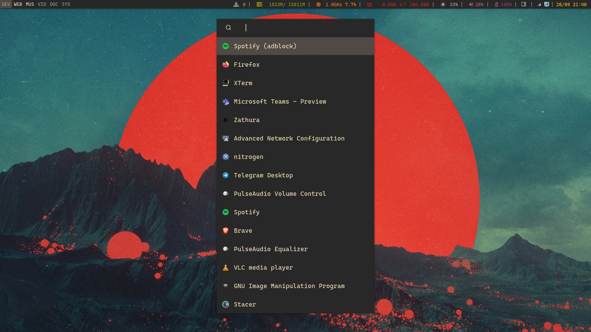

#Rofi dotfiles

## Description
### What is Rofi?
Rofi is a window switcher, application launcher and dmenu replacement, as mentioned in his [repo](https://github.com/davatorium/rofi)

### Why Rofi?
Rofi is lightweight, broadly configurable and have multiple launching modes.

### Screenshots

